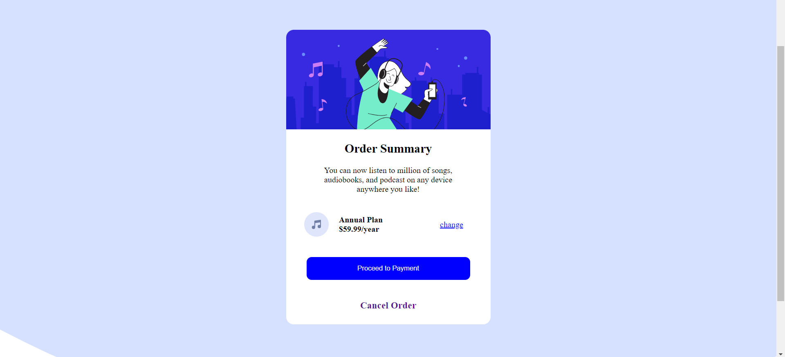

## Table of contents

- [Overview](#overview)
  - [The challenge](#the-challenge)
  - [Screenshot](#screenshot)
  - [Built with](#built-with)
  - [What I learned](#what-i-learned)
  - [Continued development](#continued-development)
  - [Useful resources](#useful-resources)
- [Author](#author)
- [Acknowledgments](#acknowledgments)

## Overview
This is a solution to the [Order summary card challenge on Frontend Mentor](https://www.frontendmentor.io/challenges/order-summary-component-QlPmajDUj). Frontend Mentor challenges help you improve your coding skills by building realistic projects.

### The challenge

Users should be able to:

- See hover states for interactive elements

### Screenshot

### Built with

- Semantic HTML5 markup
- CSS custom properties
- Flexbox
- Mobile-first Workflow

**Note: These are just examples. Delete this note and replace the list above with your own choices**

### What I learned

Understood the differences between inline and block elements. Learned how to effectively style/center a button by changing its display type from inline to block. Learned how to effectively use hover states for interractive elements.

### Continued development

I want to continue focusing on styling for responsiveness in future projects. 

### Useful resources

- [Resource 1](https://www.w3schools.com) - This helped me to understand the characteristcis of inline and block elements. I really liked this pattern and will use it going forward.

## Author 
  Name: Stephen Adebanji
- Frontend Mentor - [@StephenAdebanji](https://www.frontendmentor.io/profile/StephenAdebanji)
- Twitter - [@stevoolalah](https://www.twitter.com/stevoolalah)

## Acknowledgments

Thansk to w3schools and stackoverflow for helping through the places I was confused.

